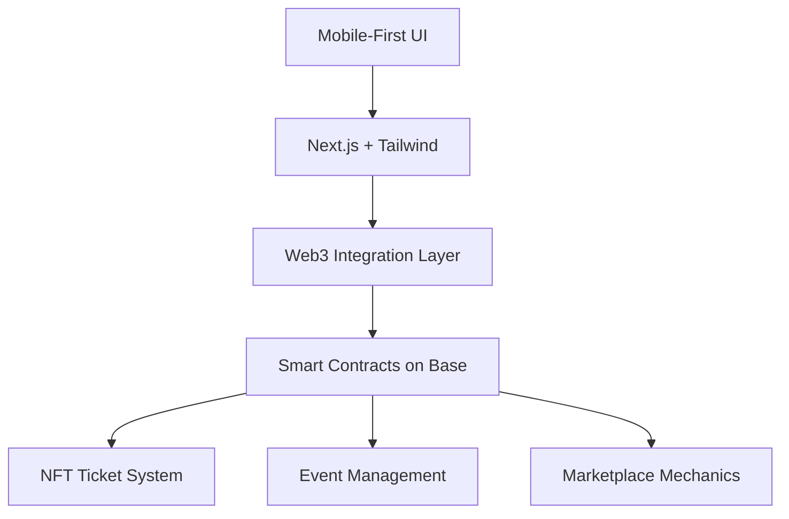

# ROVIFY

> *Where Events Become Experiences, and Tickets Become Assets*

---

## The Evolution of Event Discovery

**Rovify** isn't just another ticketing platform—it's the convergence of social discovery, blockchain ownership, and event experiences in a Web2.5 ecosystem built on Base.

```
Traditional Ticketing → Paper Tickets → Digital Tickets → ⚡ NFT TICKETS ⚡
```

We've crafted a platform where creators mint experiences, attendees own memories, and communities flourish around shared events—all through an interface so intuitive that the underlying blockchain technology becomes invisible.

---

## Core Pillars

| 💎 **Ownership** | 🔍 **Discovery** | 🤝 **Community** |
|:-----------------|:-----------------|:-----------------|
| True digital ownership of event tickets as NFTs on Base | Location and interest-based event exploration with interactive maps | Social features that connect attendees before, during, and after events |
| Verifiable authenticity eliminates counterfeiting | Personalized recommendations based on preferences and social connections | Creator tools that foster direct relationships with audiences |
| Fair secondary market with royalties for creators | Filter-based discovery across multiple dimensions | Shared experiences amplified through digital collectibles |

---

## Architecture at a Glance



Built with **Next.js** (App Router), **TypeScript**, and **Tailwind CSS** on the frontend. Smart contracts developed in **Solidity** and deployed on **Base** network for optimal speed and gas efficiency.

---

## Experience Design

The Rovify interface employs:
- Glassmorphism aesthetics with dynamic gradients
- Responsive animations that provide feedback without distraction
- Custom map pins with interactive state transitions
- Mobile-optimized interactions from discovery to ticket ownership

All wrapped in a design system that scales across devices while maintaining visual cohesion.

---

> "Rovify represents our vision for the future of events—where blockchain enhances rather than complicates the human experience of gathering."
>
> *— The Rovify Team*

---

## Beyond Web3

While built on blockchain technology, Rovify is designed for everyone:

- **For Creators**: A powerful suite of tools to create, manage, and monetize events with direct audience relationships
- **For Attendees**: A seamless discovery and ticketing experience that happens to include true digital ownership
- **For Communities**: A platform where shared experiences strengthen connections and create lasting value

---

*The revolution in event ticketing isn't about the blockchain—it's about what the blockchain enables: trust, ownership, and connection.*

[Website](https://rovify.io) • [Documentation](https://docs.rovify.io) • [Twitter](https://twitter.com/rovify)
